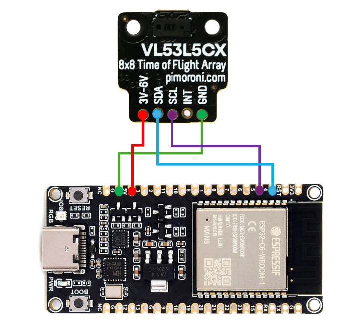

# Sensor Module Code
Owner: **Kaveesha Abeysundara** (SID: 201578163)    

Project: **Automated Tracking of Assembly Line-Side Flow Rack Parts**   

School of Mechanical Engineering   
University of Leeds  
LS2 9JT

Arduino firmware for individual sensor modules in an automated flow rack tracking system, leveraging VL53L1X ToF measurements and ESP-NOW communication.

## Table of Contents

- [About](#about)
- [Hardware Setup](#hardware-setup)
- [Prerequisites](#prerequisites)
- [Installation](#installation)
- [Usage](#usage)
- [Data Structures & Communication](#data-structures--communication)
- [Repository Structure](#repository-structure)
- [License](#license)
- [Contact](#contact)

## About

This repository hosts the Arduino sketch (`SensorModule.ino`) and supporting headers for each sensor node. Sensor modules measure distances to part boxes using a STMicroelectronics VL53L1X time-of-flight sensor, compute part counts in real time with rolling averages and Six Sigma filtering, and transmit results to a rack-level transmitter via ESP-NOW.

## Hardware Setup

| Connection | ESP32 Pin | Description                    |
|------------|-----------|--------------------------------|
| VIN        | 5V        | Sensor power (5V rail)         |
| GND        | GND       | Common ground                  |
| SDA        | 21        | I2C data line                  |
| SCL        | 22        | I2C clock line                 |
| XSHUT      | 19        | Optional sensor reset control  |

  

> Ensure all power and ground rails are shared between sensor and ESP32.

## Prerequisites

- Arduino IDE v1.8.10+ with ESP32 board support
- **Adafruit_VL53L1X** or **Pololu VL53L1X** Arduino library
- **ESP32 Arduino** libraries for ESP-NOW
- USB cable and ESP32 development board

## Installation

```bash
git clone https://github.com/kav12ab/sensormodulecode.git
cd sensormodulecode
```

1. Open `SensorModule.ino` in the Arduino IDE.
2. Install required libraries via **Sketch → Include Library → Manage Libraries**.
3. Configure `SensorID` and peer MAC addresses in `config.h`.

## Usage

1. Select **ESP32 Dev Module** and correct COM port.
2. Upload `SensorModule.ino` to each ESP32 sensor node.
3. Monitor serial output at **115200 baud** for status and debug messages.
4. Verify LED indicators: solid green for normal operation; other colours for sensor errors.

## Data Structures & Communication

Sensor modules build a data packet containing:

- `scanID` (unique sensor identifier)
- `boxCount` (calculated number of boxes)
- `autoMode` (bool flag for automatic box size detection)
- `autoBoxSize` (measured box size in mm)

These packets are sent via ESP-NOW to the rack transmitter. Retries and callbacks are managed in `comms.h`.

## Repository Structure

```plaintext
sensormodulecode/
├── .vscode/                           # JSON files for VSCODE Arduino Configuration
├── build/                             # Build logs, libraries and other files
├── ESP32_VL53L1X_Wiring_Diagram.png   # Wiring Diagram
├── sensor.ino                         # Main programme
├── .h and .cpp files                  # Custom libraries to support main program functionality
└── README.md                          # This file
```

## License

**All rights reserved.**

This firmware and documentation are proprietary. No part may be copied, modified, or distributed without permission.

## Contact

**Author:** Kaveesha Abeysundara (SID: 201578163)  


Open an issue at [sensormodulecode issues](https://github.com/kav12ab/sensormodulecode/issues).

